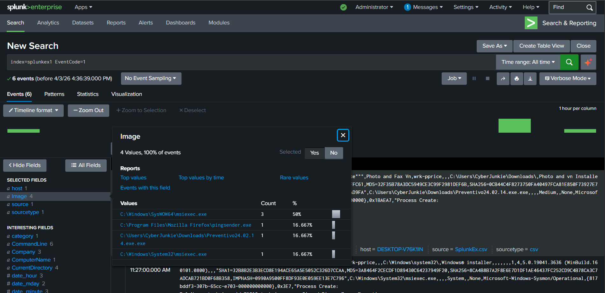
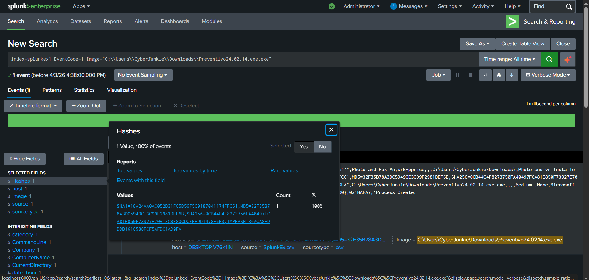
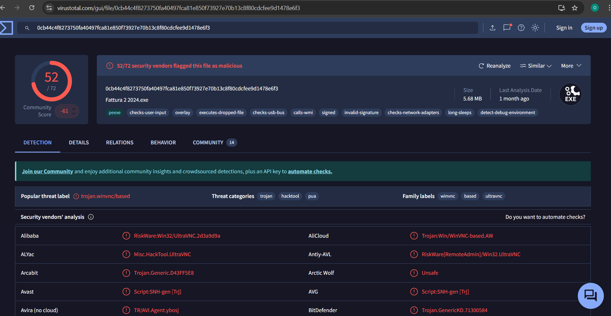

# Detecting Malicious Process Using Sysmon & Splunk

 Project Scenario

Question:
Whenever a process is created in memory, an event with Event ID 1 is recorded with details such as command line, hashes, process path, and parent process path.

This information is very useful for an analyst because it allows us to see all programs executed on a system.

Task:
What is the malicious process that infected the victim's system?

# Overview

This project focuses on identifying a malicious process by analyzing Sysmon Event ID 1 (Process Creation) logs in Splunk. The investigation highlights how behavioral analysis combined with threat intelligence can reveal malware activity.

# Tools Used
- Splunk- for searching and analyzing Sysmon logs
- Sysmon- Windows system monitoring tool
- VirusTotal- for verifying file hashes

# What l Did

---

Step 1: Search for Events

- I started by checking the event with:

```splunk
index=splunkex1 EventCode=1
```

Step 2: Analyze Process Image

- Then, I looked at the Image field. I noticed a suspicious file with .exe.exe, which is a malware trick.

```splunk
index=splunkex1 EventCode=1 Image="C:\\Users\\CyberJunkie\\Downloads\\Preventivo24.02.14.exe.exe"
```

Step 3: Review Event Details

- I looked at the entire event and grabbed a file hash.

```splunk
index=splunkex1 EventCode=1 Image="C:\\Users\\CyberJunkie\\Downloads\\Preventivo24.02.14.exe.exe" Hashes=SHA256=0CB44C4F8273750FA40497FCA81E850F73927E70B13C8F80CDCFEE9D1478E6F3
```

 Step 4: Threat Validation

- I copied one of the file hashes into VirusTotal to determine if it is malicious and I saw that it is a malicious file in VirusTotal.

 # Outcome
 So, just by searching for EventCode ID 1, we were able to discover a malicious process.

 ## **Screenshots** 

 
 
 


## **Key Learnings**

- I understand Sysmon EventCodes and their purpose in monitoring system activity.
    -For example, EventCode 1 tracks process creation.
- I can identify important fields in Sysmon logs:
  
   - Image – the executable being run
  
   - CommandLine – parameters used to launch the process
  
    - Parent – which process spawned this one
  
- I know how to extract file hashes from Sysmon logs and use VirusTotal to determine if files are malicious.
- I can spot suspicious patterns such as:
    -Double extensions (malware.exe.exe)
    -Unusual paths or processes
- This workflow strengthens threat detection and investigation skills in a SOC context.


